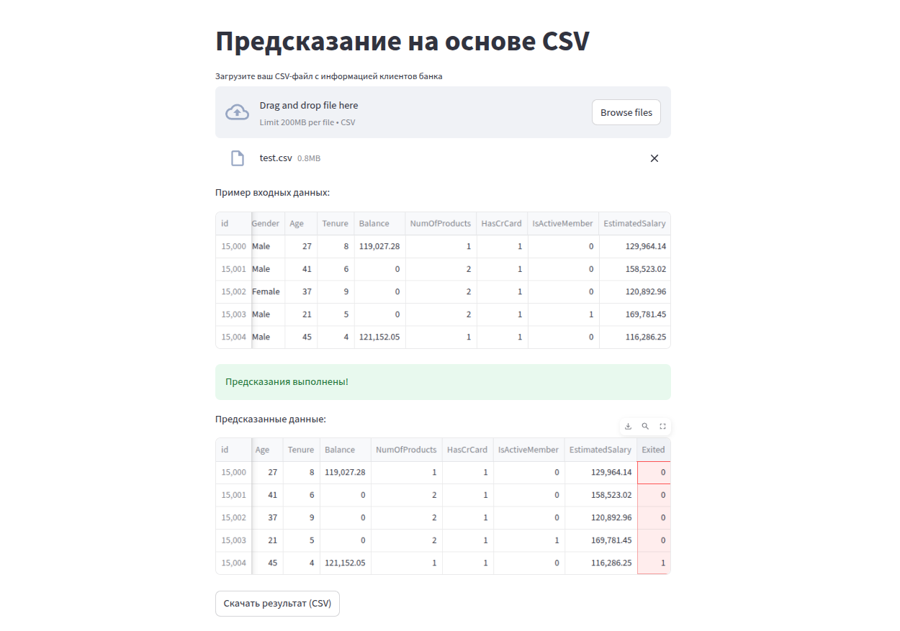

# Отборочное соревнование на стажировку в области ML


### Техническое задание

Необходимо построить модель для прогнозирования оттока клиентов банка. Данные основаны на реальных признаках клиентов, однако для целей соревнования использован синтетический датасет, сгенерированный нейронной сетью на основе реальных распределений.
 

train.csv - обучающий набор данных; Exited является бинарной целью \
test.csv — тестовый набор данных; ваша задача — предсказать вероятность Exited \
sample_submission.csv — образец файла для отправки в правильном формате


### Описание данных:

- `Customer ID`: Уникальный идентификатор клиента  
- `Surname`: Фамилия клиента  
- `CreditScore`: Кредитный рейтинг клиента (числовое значение)  
- `Geography`: Страна проживания клиента (Франция, Испания или Германия)  
- `Gender`: Пол клиента (Мужчина или Женщина)  
- `Age`: Возраст клиента  
- `Tenure`: Сколько лет клиент является клиентом банка  
- `Balance`: Баланс на счету клиента  
- `NumOfProducts`: Количество банковских продуктов, которыми пользуется клиент (например, сберегательный счёт, кредитная карта)  
- `HasCrCard`: Есть ли у клиента кредитная карта (1 = да, 0 = нет)  
- `IsActiveMember`: Является ли клиент активным пользователем (1 = да, 0 = нет)  
- `EstimatedSalary`: Примерная зарплата клиента  
- **`Exited`: Ушёл ли клиент из банка (Целевой признак)**

### Вывод:

В датасете отсутсвуют пропуски и дубликаты. Чаще всего страной проживания клиента является Франция, из которой ушло 15% пользователей, из Испании - 17%, из Германии - 40%. Средний возраст клиентов банка - 37 лет, средний возраст ушедших клиентов - 45 лет, у оставшихся - 35 лет. Основная клиентская база: 32-42 года. Всего 9739 клиентов, не хранящих деньги на счетах, из них большая часть из Испании и Франции, зато абсолютно все клиенты из Германии имеют баланс на счету. Большая часть клиентов, имевших более двух банковских продуктов, покинула банк. Среди ушедших, не активными пользователями были 72%. Целевой признак имеет явный дисбаланс классов.

1. Мультиколлинеарность:
    - Высокая у `Geography` и `Balance` - 0.75
    - Слабая у `Balance` и `NumOfProducts` - 0.68

2. Связь с целевым:
    - `Age` - 0.69
    - `NumOfProducts` - 0.68

На первой итерации модели были обучены на исходных данных, лучшая модель: **GradientBoostingClassifier**: ROC-AUC - 0.936 \
После анализа важности признаков, выяснилось, кредитный рейтинг не имеет никакого влияния на утечку клиентов. \
- Гиперпараметры лучшей модели на первой итерации:
    - learning_rate=0.0389
    - max_depth=5
    - min_samples_leaf=3
    - min_samples_split=10
    - n_estimators=216
    - subsample=0.768


На второй итерации были добавлены наблюдения минорного класса из датасета по которому генерировали данные. Лучшая модель: **SVC**: ROC-AUC - 0.926 \
Корреляция признака `NumOfProducts` ухудшилась с целевым после добавления новых данных. \
Метрики всех моделей, кроме **GBC** стали незначильно больше. \
Не удалось увеличить метрику по сравнению с прошлой итерацией.
- Гиперпараметры лучшей модели на второй итерации:
    - models__kernel='rbf'
    - models__C=3
    - models__degree=4

На третьей итерации признаки `Balance` и `Age` были переведены в категориальные. Добавленные признаки имеют большую корреляцию с целевым, по сравнению с изначальными. Лучшая модель: **KNeighborsClassifier**: 0.918 ROC-AUC \
Не удалось увеличить метрику по сравнению с прошлой итерацией.
- Гиперпараметры лучшей модели на третьей итерации:
    - n_neighbors=48

Лучшая модель была получена на первой итерации. Данные были подготовлены, используя пайплайн и были получены вероятности принадлежности к классу 1 для каждого наблюдения в тестовом наборе.


# Запуск приложения с GUI

## Интерактивное Streamlit-приложение для предсказания оттока клиентов банка на основе модели машинного обучения.

Приложение позволяет загрузить CSV-файл с данными клиентов и получить предсказание модели `GBC_model.pkl`, обученной для определения вероятности оттока. \
Результаты отображаются в таблице и доступны для скачивания.

### Локальная сборка

1. Для локального запуска, убедитесь, что у вас установлен Python 3.11+:
```bash
python3 --version
```

2. Установите зависимости 
```bash
pip install -r app/requirements.txt
```

3. Запустите приложение:
```bash
streamlit run app/app.py
```

### Сборка в контейнере

1. Соберите Docker-образ:
```bash
docker build -t churn-prediction-app .
```

2. Запустите контейнер:
```bash
docker run -p 8501:8501 churn-prediction-app
```

3. Откройте в браузере адрес: http://localhost:8501

